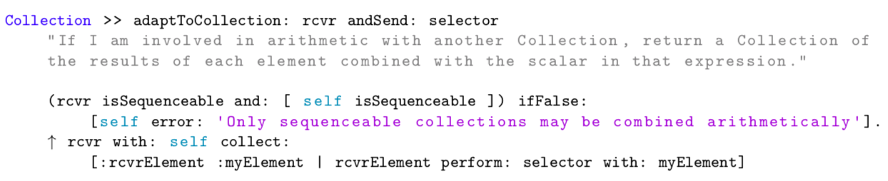

# Smalltalk environment for listings in LaTeX

Smalltalk code highlighting in LaTeX documents



## How to use?
Just add the following line to your file:

```Latex
\input{smalltalkEnv}
```
Then you can use:

```Latex
\begin{lstlisting}[language=Smalltalk]
Collection >> adaptToCollection: rcvr andSend: selector
    "If I am involved in arithmetic with another Collection, return a Collection of
    the results of each element combined with the scalar in that expression."

    (rcvr isSequenceable and: [ self isSequenceable ]) ifFalse:
        [self error: 'Only sequenceable collections may be combined arithmetically'].
    ^ rcvr with: self collect:
        [:rcvrElement :myElement | rcvrElement perform: selector with: myElement]
\end{lstlisting}
```
